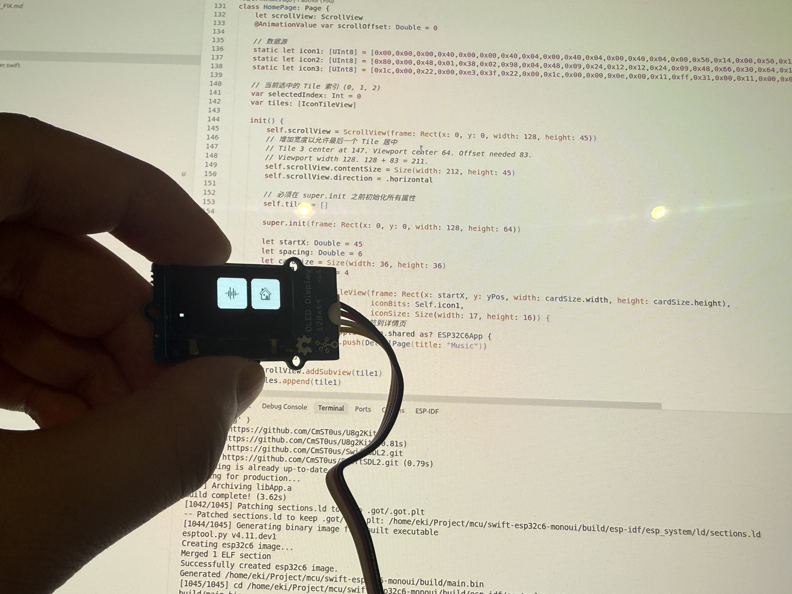

# Swift Embedded ESP32C6 MonoUI Demo

<p align="center">
  
</p>

This is an ESP32C6 OLED display application demo project based on **Embedded Swift** and the **MonoUI** framework. The project demonstrates how to build modern user interfaces using Swift in embedded environments.

## Features

- 🚀 **Embedded Swift** - Run Swift code on ESP32C6
- 🎨 **MonoUI Framework** - Modern UI framework with page routing, animations, and componentization
- 📺 **OLED Display** - Drive 128x64 OLED screen using U8g2
- ⌨️ **Serial Keyboard Input** - Interactive control via serial port
- 🎬 **Smooth Animations** - Page transition and scroll animations

## Project Structure

```
.
├── CMakeLists.txt              # Main CMake configuration
├── main/
│   ├── CMakeLists.txt         # Component CMake configuration
│   ├── Package.swift          # Swift package manifest
│   ├── patch_sections_ld.cmake # Swift GOT/PLT fix script
│   └── Source/
│       ├── App/               # Main application code
│       │   ├── App.swift      # Application entry point and page definitions
│       │   └── ESP32U8g2Driver.swift  # U8g2 driver implementation
│       └── Support/           # Support code
│           ├── include/        # C header files
│           │   ├── support.h  # Swift-C bridging header
│           │   ├── uart.h     # UART serial interface
│           │   ├── i2c.h      # I2C interface
│           │   └── rtos_utils.h  # FreeRTOS utility functions
│           └── src/           # C source files
│               ├── uart.c     # UART implementation
│               ├── i2c.c      # I2C implementation
│               └── rtos_utils.c  # FreeRTOS utility implementation
├── partitions.csv              # Custom partition table
├── sdkconfig                   # ESP-IDF configuration
└── docs/                        # Documentation directory
    └── SWIFT_GOT_PLT_FIX.md    # Swift GOT/PLT fix documentation
```

## Features Overview

### UI Interface

- **Home Page (HomePage)**: Displays three scrollable icon cards (Music, Settings, Download)
- **Detail Page (DetailPage)**: Detail page entered after clicking a card, with slide-in/slide-out animations

### Interactive Controls

Keyboard input control via serial port (UART):

- `a` / `A` - Navigate left (select previous card)
- `d` / `D` - Navigate right (select next card)
- `e` / `E` - Enter/Activate (open selected card's detail page)
- `q` / `Q` - Go back (return from detail page to home page)

### Technical Implementation

1. **Routing System**: Uses `Router` to manage page navigation and state
2. **Animation System**: Uses `@AnimationValue` to implement smooth page transitions and scroll animations
3. **Time Synchronization**: Uses FreeRTOS tick count to provide a monotonically increasing time source

## Building and Running

### Prerequisites

1. **ESP-IDF** (v5.5+)
   ```bash
   # Install ESP-IDF
   git clone --recursive https://github.com/espressif/esp-idf.git
   cd esp-idf
   ./install.sh esp32c6
   . ./export.sh
   ```

2. **Swift Toolchain** (with Embedded Swift support)
   - Requires Swift toolchain that supports `-enable-experimental-feature Embedded`
   - Recommended: Swift 6.1+

### Configuring the Project

1. Set target chip:
   ```bash
   idf.py set-target esp32c6
   ```

2. Configure project (optional):
   ```bash
   idf.py menuconfig
   ```

   Main configuration items:
   - Flash size: Configure according to your hardware (default 8MB)
   - Partition table: Uses custom partition table `partitions.csv`
   - Optimization level: Configured as `-Osize` to reduce binary size

### Building

```bash
idf.py build
```

### Flashing

```bash
idf.py -p /dev/ttyUSB0 flash
```

### Monitoring

```bash
idf.py -p /dev/ttyUSB0 monitor
```

## Hardware Connections

### OLED Display (SSD1306 128x64)

- **I2C Interface**
  - SDA: GPIO (configured in `i2c.c`)
  - SCL: GPIO (configured in `i2c.c`)
  - Address: `0x3C`

### Serial Port (for keyboard input)

- **UART_NUM_0** (usually USB Serial/JTAG)
  - Baud rate: 115200
  - Used for receiving keyboard input

## Known Issues and Solutions

### Swift GOT/PLT Linking Error

**Issue**: Linker error: `discarded output section: '.got.plt'`

**Cause**: ESP-IDF's linker script discards the `.got.plt` section, but the Swift compiler requires these sections.

**Solution**: The project includes an automatic fix script `patch_sections_ld.cmake` that automatically patches the linker script during build.

For detailed information, see: [docs/SWIFT_GOT_PLT_FIX.md](docs/SWIFT_GOT_PLT_FIX.md)

### Unicode Normalization Issue

**Issue**: Linker error when using `Character("x").asciiValue!` (`undefined reference to '_swift_stdlib_getNormData'`)

**Cause**: Embedded Swift lacks complete Unicode normalization runtime functions.

**Solution**: Use direct ASCII constant values, for example:
```swift
let key_q: Int32 = 113  // ASCII value of 'q'
```

### Binary Size Optimization

The project has applied multiple optimization measures:

- Compiler optimization: `-Osize` (size optimization)
- Linker optimization: `--gc-sections`, `--strip-debug`, `--strip-all`
- Disabled unused ESP-IDF components (WiFi, BT, MQTT, etc.)
- Log level set to ERROR

## Dependencies

### Swift Packages

- **U8g2Kit** - Swift wrapper for U8g2 graphics library
  - Repository: https://github.com/CmST0us/U8g2Kit
  - Branch: `main`
  
- **MonoUI** - Embedded UI framework
  - Local path: `/home/eki/Project/swift/MonoUI`
  - Features: Page routing, animations, component system

### ESP-IDF Components

- `driver` - I2C, UART drivers
- `freertos` - FreeRTOS real-time operating system
- `esp_system` - System core functionality

## Development Guide

### Adding a New Page

1. Create a class inheriting from `Page`:
```swift
class MyPage: Page {
    override func draw(u8g2: UnsafeMutablePointer<u8g2_t>?, origin: Point) {
        // Drawing logic
    }
    
    override func handleInput(key: Int32) {
        // Input handling
    }
}
```

2. Navigate in router:
```swift
if let app = Application.shared as? ESP32C6App {
    app.router.push(MyPage())
}
```

### Adding Animations

Use the `@AnimationValue` property wrapper:
```swift
@AnimationValue var offsetX: Double = 0

override func animateIn() {
    offsetX = 100  // Automatically animates to target value
}
```

### Serial Input Handling

Handle input in the page's `handleInput(key:)` method:
```swift
override func handleInput(key: Int32) {
    let key_e: Int32 = 101  // 'e'
    if key == key_e {
        // Handle input
    }
}
```

## Contributing

Contributions are welcome! Please feel free to submit a Pull Request.

## License

This project is licensed under the Apache License 2.0 - see the LICENSE file for details.

## Related Resources

- [ESP-IDF Documentation](https://docs.espressif.com/projects/esp-idf/en/latest/)
- [Swift for Embedded Systems](https://www.swift.org/blog/embedded-swift/)
- [U8g2 Graphics Library](https://github.com/olikraus/u8g2)
- [MonoUI Framework](https://github.com/CmST0us/MonoUI)
